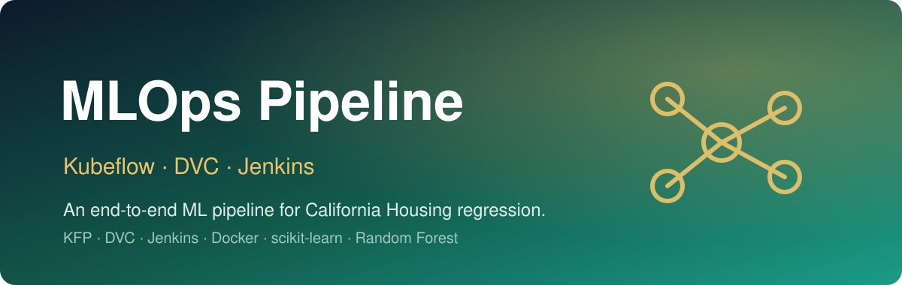

<p align="center">
  
</p>

<h1 align="center">MLOps Pipeline</h1>

<p align="center"><em>An end-to-end ML pipeline for California Housing regression — Kubeflow Pipelines, DVC data versioning, and Jenkins CI.</em></p>

<p align="center">
  
  
  
  
  
  
</p>

This project implements a complete **MLOps pipeline** for the **California Housing** dataset. It uses **Kubeflow Pipelines (KFP)** to orchestrate four containerized stages — load, preprocess, train, and evaluate — with **DVC** for dataset versioning and a **Jenkins** pipeline that compiles the components and pipeline definition on every change. The model is a scikit-learn **Random Forest Regressor**.

> Reproducible, containerized, and CI-driven: every stage is a versioned component and every dataset is tracked.

---

## ✨ Features

- **Modular KFP components** — each stage (`load_data`, `preprocess_data`, `train_model`, `evaluate_model`) is a self-contained, containerized component compiled from Python functions.
- **DVC data versioning** — the raw dataset is tracked via `data/raw_data.csv.dvc` against a local DVC remote, so data is reproducible alongside code.
- **Jenkins CI** — `Jenkinsfile` installs dependencies, recompiles the components, and compiles the pipeline definition on each run.
- **Containerized** — a `python:3.9-slim` `Dockerfile` packages the project; KFP components run on `python:3.9` images.
- **Real evaluation** — the evaluate stage reports **MSE** and **R²** and writes them to a metrics output.

## 🏗️ Architecture

The pipeline is a four-stage DAG. `preprocess_data` performs a train/test split and `StandardScaler` scaling; the train and test branches feed model training and evaluation respectively.

```
                          ┌──────────────────┐
                          │   load_data      │
                          │ fetch California │
                          │ Housing → CSV    │
                          └────────┬─────────┘
                                   │
                          ┌────────▼─────────┐
                          │ preprocess_data  │
                          │ split + scale    │
                          └───┬──────────┬───┘
                  train_data  │          │  test_data
                          ┌───▼────┐     │
                          │ train_ │     │
                          │ model  │     │
                          │  (RF)  │     │
                          └───┬────┘     │
                        model │          │
                          ┌───▼──────────▼───┐
                          │  evaluate_model  │
                          │   MSE  ·  R²      │
                          └──────────────────┘
```

**Stack:** Kubeflow Pipelines · DVC · Jenkins · Docker · scikit-learn (RandomForestRegressor) · pandas · numpy

## 🚀 Run it

**Prerequisites:** Python 3.9+, [Minikube](https://minikube.sigs.k8s.io/), [Kubeflow Pipelines](https://www.kubeflow.org/docs/components/pipelines/), and [DVC](https://dvc.org/).

**1. Install dependencies**
```bash
pip install -r requirements.txt
```

**2. Pull the versioned dataset (DVC)**
```bash
dvc pull
```

**3. Bring up Minikube & Kubeflow Pipelines**
```bash
minikube start
kubectl port-forward -n kubeflow svc/ml-pipeline-ui 8080:80
```

**4. Compile the components and the pipeline**
```bash
python src/pipeline_components.py   # regenerates components/*.yaml
python pipeline.py                  # produces pipeline.yaml
```

**5. Upload & run**

Open the KFP dashboard (`http://localhost:8080`), upload the generated `pipeline.yaml`, and create a run.

### 🐳 Docker

Build the project image:
```bash
docker build -t mlops-pipeline .
```

## 🔧 CI (Jenkins)

The `Jenkinsfile` defines a declarative pipeline with two stages:

| Stage | Action |
|-------|--------|
| **Environment Setup** | `checkout scm` and `pip install -r requirements.txt` |
| **Pipeline Compilation** | recompile components (`python src/pipeline_components.py`), compile the pipeline (`python pipeline.py`), and verify `pipeline.yaml` |

## 📦 Project Structure

```
.
├── components/            # compiled KFP component specs (load, preprocess, train, evaluate)
├── data/
│   └── raw_data.csv.dvc   # DVC-tracked dataset pointer
├── src/
│   ├── pipeline_components.py  # component functions + compiler
│   └── model_training.py       # standalone Random Forest training script
├── pipeline.py            # KFP pipeline definition (compiles to pipeline.yaml)
├── pipeline.yaml          # compiled pipeline spec
├── Dockerfile             # python:3.9-slim image
├── Jenkinsfile            # CI pipeline
└── requirements.txt       # kfp, dvc, scikit-learn, pandas, numpy
```
